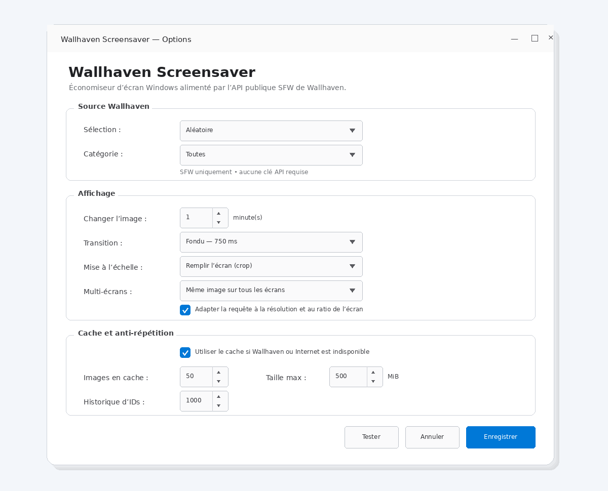

# Wallhaven Screensaver

Wallhaven Screensaver is a native Windows screen saver powered by the public **SFW** Wallhaven API.
It rotates high-resolution artwork automatically, adapts Wallhaven searches to the display resolution/aspect ratio, and keeps a persistent anti-repeat history plus a small ready cache.

> This project is not affiliated with or endorsed by Wallhaven.

> **Status:** `0.1.1` is the current public release. The branch carrying the filtering/cache redesign is validated by tests and a local Windows build before merge.

## Configuration preview



## Content filtering

Wallhaven is **always** queried with:

```text
purity=100
```

The application can add a second metadata-based filtering layer:

| Mode | Behaviour |
| --- | --- |
| Standard | Wallhaven SFW only; no extra local rejection |
| Reduced | rejects strong adult/suggestive metadata while preserving ordinary subjects |
| Strict | conservative/fail-closed; rejects strong sexual/exposure tags, female-focused metadata, ambiguous Anime/People results, and combinations of weaker risk signals |

Strict is a port of the **Strict v5** policy used by Wallhaven Rotator Android. Reduced and Strict inspect Wallhaven's detailed metadata/tags before downloading an accepted candidate. Strict intentionally prefers false positives over regularly letting suggestive content through.

The filter is based on **Wallhaven metadata**, not image recognition. It therefore reduces risk but cannot mathematically guarantee the visual content of every image.

A custom Wallhaven query can be entered in the options. In Reduced/Strict, compatible negative terms are added to the query as a first-pass optimisation, while local metadata inspection remains authoritative.

## Anti-repeat guarantees

Every successful display is persisted with:

- Wallhaven ID;
- UTC display timestamp.

For the current local day, `seenToday` is rebuilt from timestamps. An ID in `seenToday` is a **hard exclusion**:

```text
candidate.id in seenToday => reject
```

This survives:

- screensaver restart;
- Windows reboot;
- cache cleanup/rebuild;
- profile/filter/source changes;
- application upgrades.

If no fresh candidate can be found, the current image remains instead of deliberately breaking the daily rule.

The rolling history defaults to **5,000 IDs** and can be configured from 1,000 to 20,000. Recent history is avoided during normal refill. Only when a source/query is unusually narrow may older entries be recycled, with the oldest preferred first; same-day entries remain forbidden.

The timestamped history is stored under:

```text
%LOCALAPPDATA%\Wallhaven\history-v2.json
```

The pre-redesign Windows ID-only history is migrated conservatively: because its original timestamps are unknowable, legacy IDs are treated as seen on the migration day so the hard daily rule cannot be weakened during upgrade.

> This repository contains the screen saver. The shared history location is intentionally suitable for the separate Windows desktop rotator, but that project needs a companion integration before a mathematically hard cross-application guarantee can be claimed.

## Cache and candidate deduplication

The ready cache is intentionally much smaller than the history:

- ready pool target: **12 images** by default (configurable 8–20);
- global file cap: 50 by default;
- global size cap: 500 MiB by default;
- asynchronous refill when the active pool drops below its low watermark.

Pool identity includes:

- selection/source;
- category;
- custom query;
- Standard/Reduced/Strict mode;
- Strict policy version;
- display-aware resolution/ratio.

Changing a profile therefore switches to a different ready pool without resetting global history.

Before a candidate is downloaded, it is rejected if its ID is:

- in `seenToday`;
- in recent long-term history during normal refill;
- already cached in another pool;
- currently leased for display;
- currently being downloaded by another process.

Pending download reservations use atomic lock files, so duplicate downloads are also prevented across concurrent screen-saver processes.

After a wallpaper is **successfully displayed**:

1. its ID/timestamp is persisted in history;
2. the consumed cache file is removed;
3. asynchronous refill is scheduled if necessary.

A failed download or failed image decode/display does **not** consume the ID in history.

### Clear cache vs history

**Vider le cache** removes ready image files only. It never resets anti-repeat history.

A separate, explicit **Réinitialiser l'historique** action is available and asks for confirmation.

## Diagnostics

The project logs and counts:

```text
candidate_rejected_daily_repeat
candidate_rejected_recent_history
candidate_rejected_pending_duplicate
candidate_rejected_strict_filter
candidate_rejected_reduced_filter
candidate_accepted
```

The options dialog exposes a diagnostic summary with:

- IDs seen today;
- rolling history size;
- cache files/bytes;
- pending/leased candidates;
- duplicate/filter rejection counters;
- accepted display count.

Runtime logs remain under `%LOCALAPPDATA%\WallhavenScreensaver\logs`.

## Features

- Native Windows screen saver modes: `/s`, `/c` and `/p <HWND>`
- Random, trending, popular and newest Wallhaven selections
- General, Anime, People or All categories
- Optional custom Wallhaven query
- Standard / Reduced / Strict metadata filtering
- **SFW-only** API requests (`purity=100`)
- Display-aware resolution and aspect-ratio filtering
- 1 to 120 minute rotation interval
- Optional fade transitions
- Fill/crop or fit/letterbox rendering
- Multi-monitor support
- Hard daily anti-repeat
- Rolling long-term history
- Profile-aware ready cache
- Cross-pool / pending candidate deduplication
- Seven-day rotating text logs
- No project telemetry or analytics

## Runtime data

```text
%LOCALAPPDATA%\WallhavenScreensaver
├── settings.json
├── diagnostics.json
├── cache\
└── logs\

%LOCALAPPDATA%\Wallhaven
└── history-v2.json
```

## Install

Download the current Windows x64 ZIP from the GitHub Releases page, extract it, then run:

```powershell
.\Install.ps1
```

The installer copies `WallhavenScreensaver.scr` to the current user's local application data and selects it as the current screen saver.

## Build and tests

Requirements:

- Windows 10/11 x64
- .NET 10 SDK

Run the dependency-free regression suite:

```powershell
dotnet run --project .\tests\WallhavenScreensaver.Tests\WallhavenScreensaver.Tests.csproj -c Release
```

Publish the self-contained Windows x64 executable:

```powershell
dotnet publish .\src\WallhavenScreensaver\WallhavenScreensaver.csproj `
  -c Release `
  -r win-x64 `
  --self-contained true `
  -p:PublishSingleFile=true `
  -p:PublishTrimmed=false `
  -o .\build

Copy-Item .\build\WallhavenScreensaver.exe .\WallhavenScreensaver.scr
```

## Privacy

The runtime contacts Wallhaven only for image search, metadata inspection in Reduced/Strict mode, and image downloads. It does not include project telemetry, analytics, advertising or tracking endpoints.

## Release signing

The current release is unsigned. Verify the SHA-256 file provided with a release before use.

## License

MIT. See [LICENSE](LICENSE).
